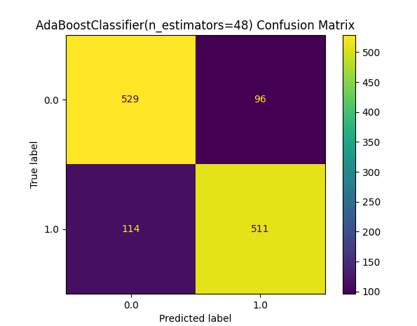
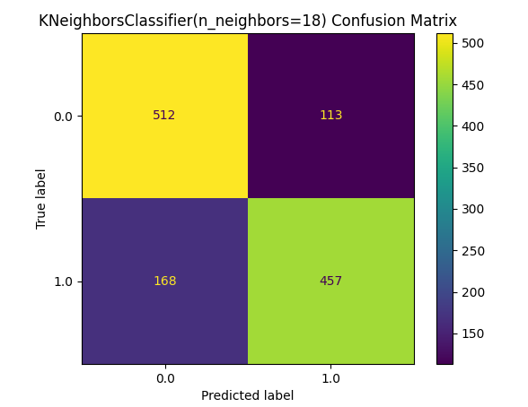
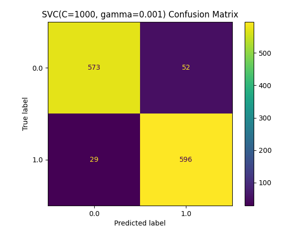
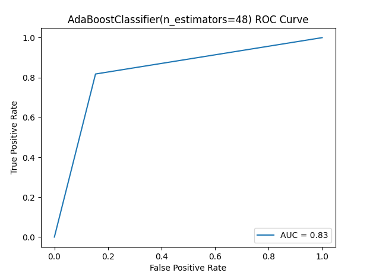
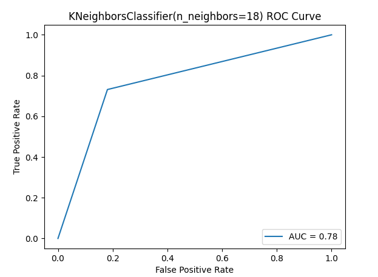
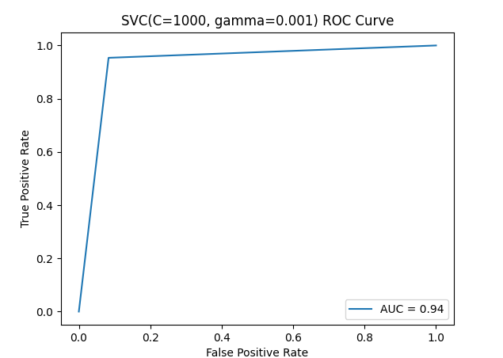

# Classifier Performance

This project compares the results of different classifiers, using metrics, such as, computational time, confusion matrix and ROC curves.

## Algorithms used:
- K Nearest Neighbors
- AdaBoost
- Support Vector Machine

## Results

### Confusion Matrix

  

  

  

### ROC Curve

  

  

  

